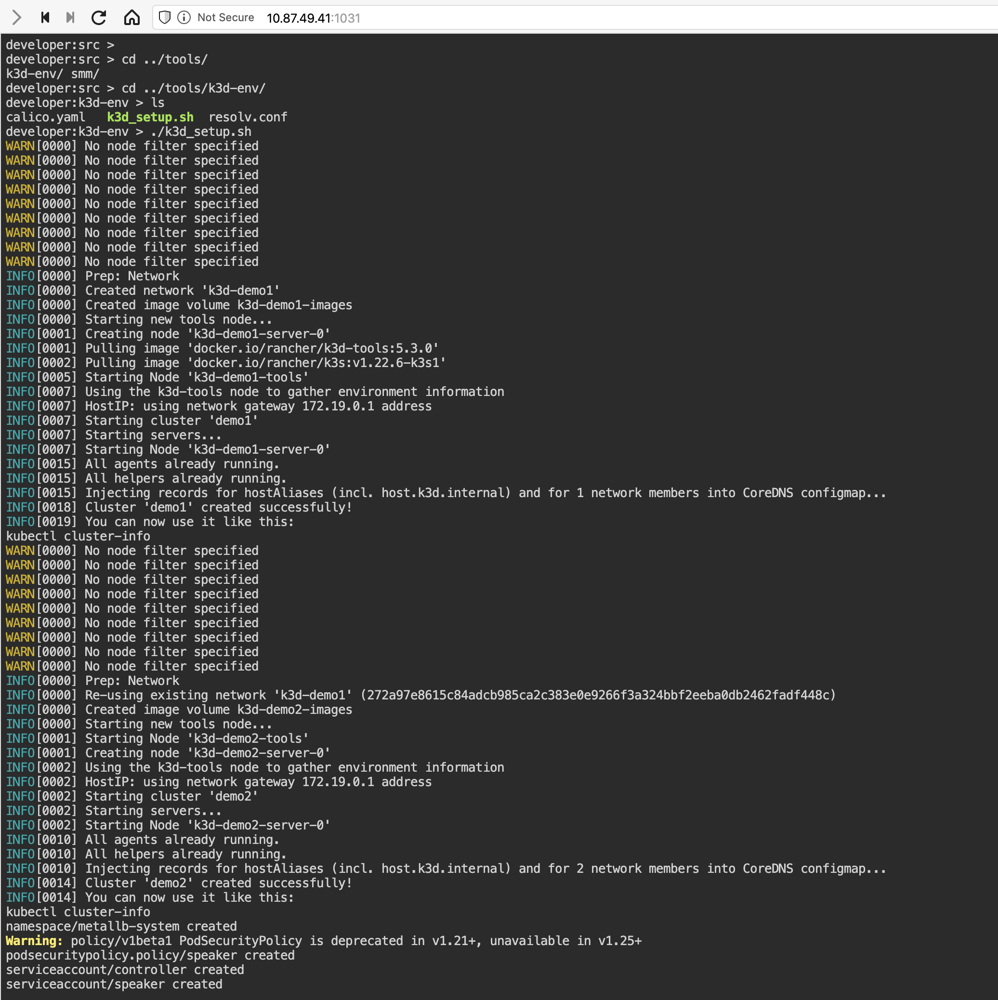
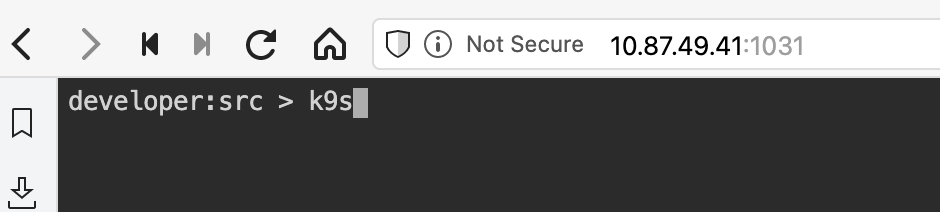
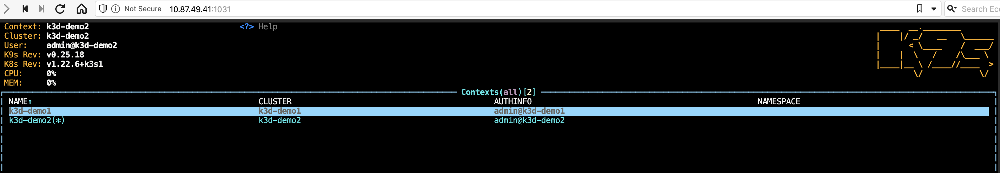
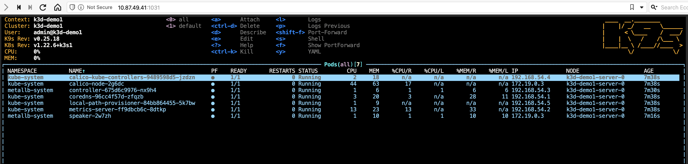
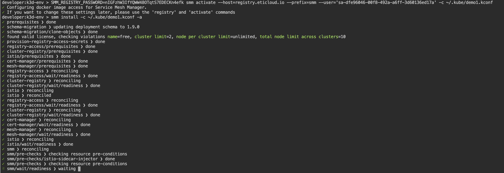
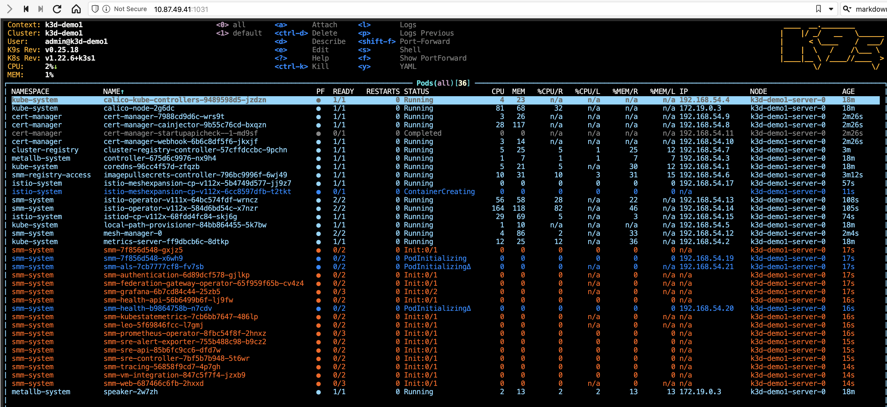
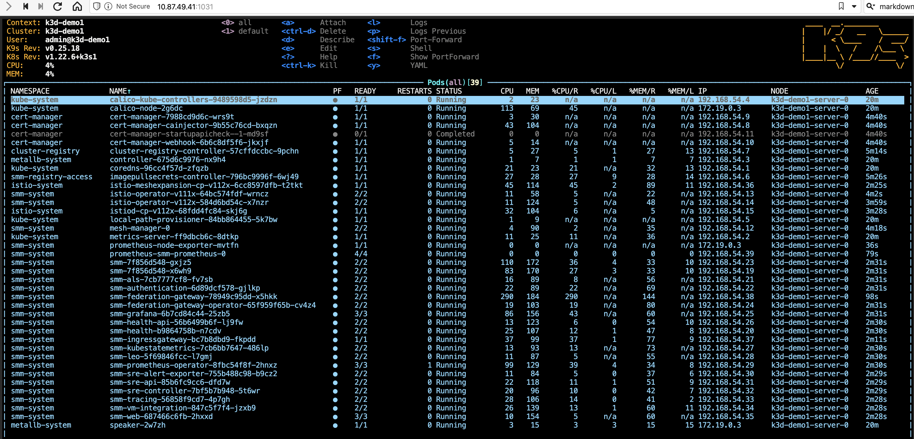
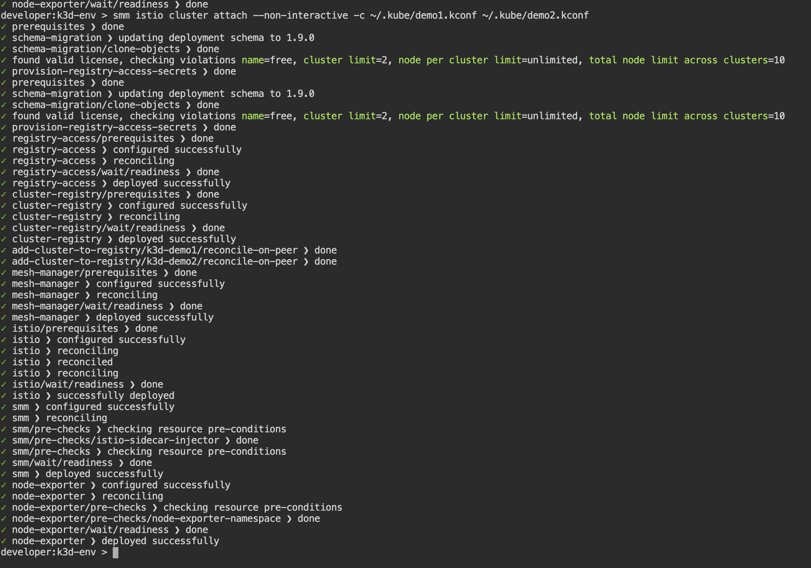
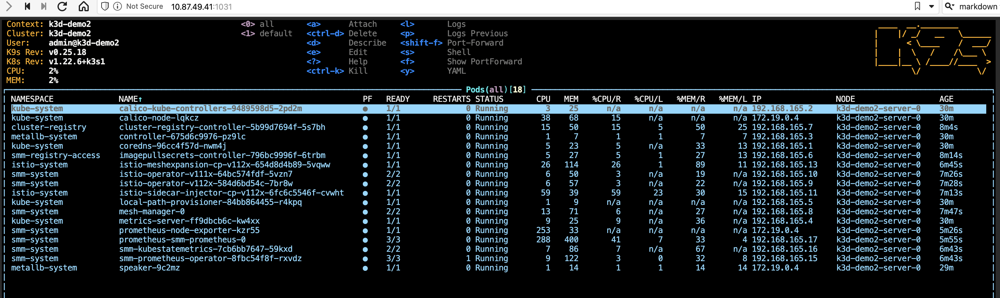
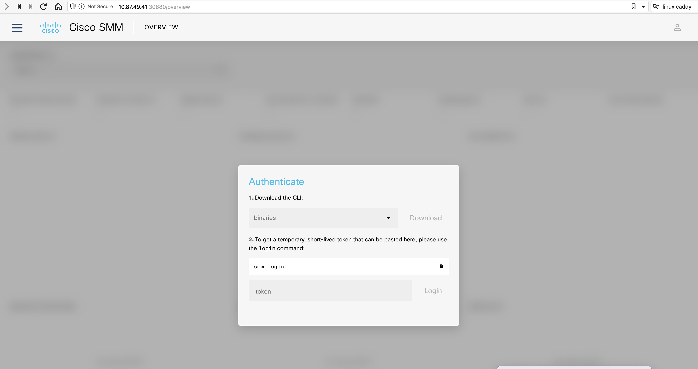

# K3D Multicluster Setup

This dev/demo environment is for building out multicluster scenarios.  It sets up k3d clusters (k3d is to k3s as KinD is to K8s).

## Usage

### Container bringup

Options:

1.  If cloned this repo:

    ```
    make run
    ```

2.  Otherwise use docker directly:

    ```
    docker run --privileged --name devenv-k3d -d -p 1001:9090 -p 8080:8080 -e "DEVENV_PASSWORD=secret" -e "DEVENV_PASSWORD=secret" -e "DEVENV_APP_URL=http://localhost:8080" containers.cisco.com/tiswanso/devenv-base-k3d:latest
    ```

Once up, new terminals can be instantiated via opening browser tabs to `localhost:1001`

### K3d cluster setup

To create a pair of k3d clusters on the same docker network with metallb configured as the k8s service loadbalancer:

```
cd ~/tools/k3d-env
./k3d_setup.sh
```

The kubeconfigs are in `~/.kube/demo*.kconf**.



#### `k3d_setup.sh` Options

| Env Var      | Default | Description                                                                                       |
|--------------|---------|---------------------------------------------------------------------------------------------------|
| K3D_NUMPEERS |     1 | Number of peer clusters to create                                                                    |
| K3D_NAMEPRFX | demo | Name prefix to use for clusters.  Each cluster instance will have a number after the name prefix.     |
| K3D_API_PORT | 6135 | Starting port number to expose the k8s API server on--subsequent cluster instance will increase by 1. |


### k9s

k9s is usable as a Kubernetes cluster dashboard.  Simply run `k9s` and use `:context` to see the `demo1` and `demo2` contexts.








### SMM Setup

To install SMM on cluster `demo1` and configure cluster `demo2` as a multicluster peer:

```
SMM_REGISTRY_PASSWORD=nIGFzhW3IfYQWW48OTqtS7EDECKn4efk smm activate --host=registry.eticloud.io --prefix=smm --user='sa-dfe96046-00f8-492a-a6ff-3d60136ed17a' -c ~/.kube/demo1.kconf
smm install -c ~/.kube/demo1.kconf -a
smm istio cluster attach --non-interactive -c ~/.kube/demo1.kconf ~/.kube/demo2.kconf
```











#### SMM dashboard access

In a new window (browser terminal http://localhost:1001)

1. Proxy the exposed host port to the dashboard listening port.  The host running the `docker run` command has its port
   30880 mapped to port 8080 inside the container with k3d running.  We'll use `caddy` to proxy that to the port
   `smm dashboard` is using.
   
   ```
   caddy reverse-proxy --from :8080 --to 127.0.0.1:50500 &
   smm dashboard --kubeconfig ~/.kube/demo1.kconf &
   ```

2. Access the dashboard via browser on your docker host via `http://localhost:30880`

   

3. Use `smm login --kubeconfig ~/.kube/demo1.kconf** to obtain the token to login to the dashboard.

4. Enter the token into the dashboard's login via the browser.

**NOTE:** This currently doesn't work to login.  The SMM login token doesn't seem to be accepted and it reprompts to
login again.
