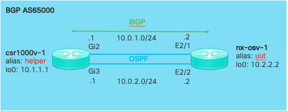

# Introduction to the Lab

In this **Intro to pyATS** lab, you will take a snapshot of a network and compare it to a snapshot taken a later time to learn more about network behavior. Taking a snapshot is easy to do and is very powerful. Once you have this initial snapshot, you can take a second one and compare them to quickly see what has changed.

Let's think of a few examples where this is very powerful.

* **Network Monitoring**: Every day at 3:00 AM, take a snapshot of the network and automatically compare it to a previous snapshot. When you enter the office, you know exactly what has changed overnight, which will help tremendously with triaging cases.

* **Pre/Post Migration of Hardware**: How do you make sure that you did not lose any routes or neighbors? pyATS helps network engineers during their network migration to ensure nothing is lost, and if a route is lost, the exact value is known and can be recovered quickly.

* **Pre/Post Configuration Changes**: Besides `ping`, how do you verify that your configuration has been applied correctly? pyATS enables you to see the changes in real time, enabling you to verify they are the correct changes.

There are many other scenarios where snapshot comparison is useful. During the interactive portion of the lab, you will see how quick and easy it is to get setup and running.

Let's get started!

## Topology
Congratulations! You are now in charge of the following top-secret network:

The network is *currently* performing as expected. Your task, should you choose to accept it, is to ensure that it remains up and operational at all times. If the network experiences issues, you must react quickly and fix it!

Sound familiar?
